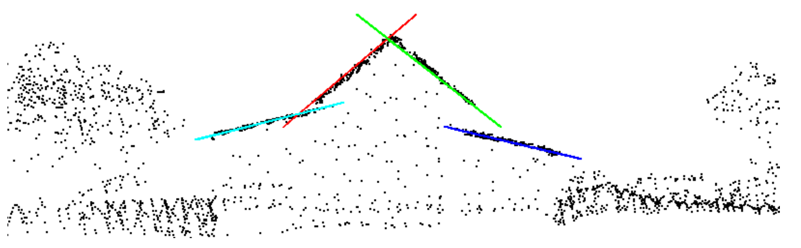
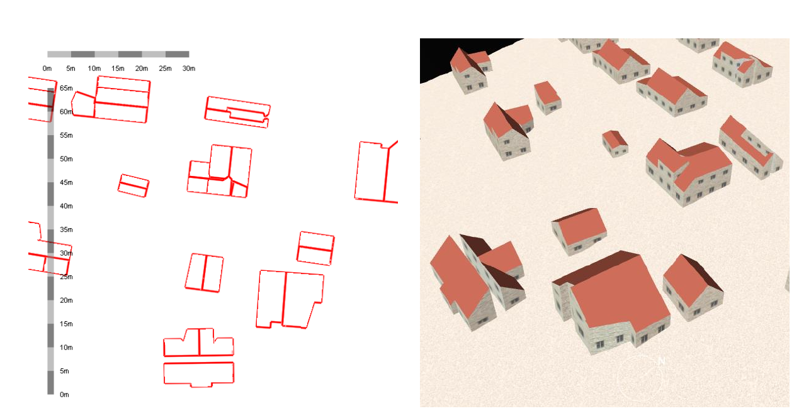

# Model Fit

## [Automatic Generation of 3D Building Models from Point Clouds](papers/GIS2014_HRON_fullPaper.pdf)

* Classification of point cloud -> Creation of 3D building models

### Creation of 3D building models

* Based on RANSAC
* Principle is to find geometric primitives by interleaving planes through the point cloud.

* The created 3D models of buildings can be visualized as wire-frame objects or more realistic 3D objects
covered by textures.

* The software doesn't contain any knowledge base of buildings or roof shapes.

## [Flexible building promitives for 3D building model](http://www.doc88.com/p-6711256173949.html)

* Put forward one topograph method to reconstruct the roof from the point cloud.

## [A Framework for Automatic Modeling from Point Cloud Data](papers/POULLIS_TPAMI2013.pdf)

* [Code](https://github.com/charalambos/StructurePointcloud)